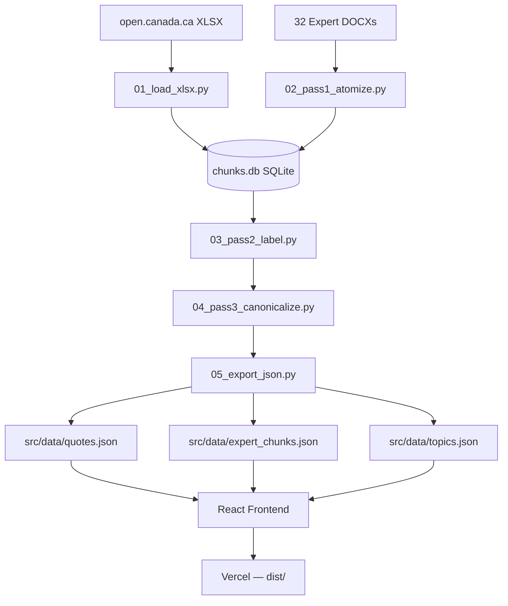
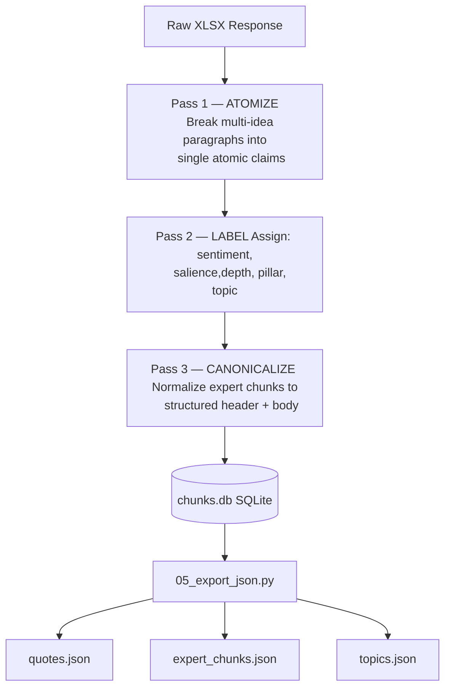
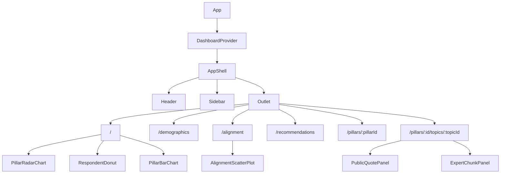
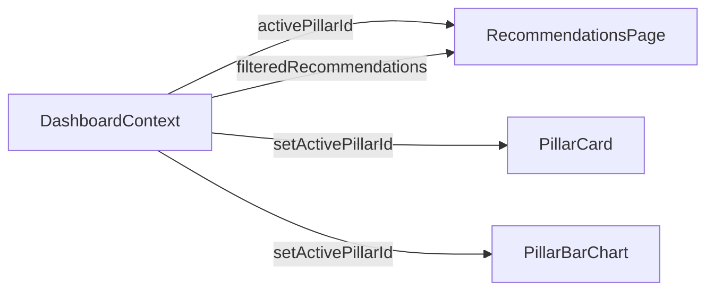
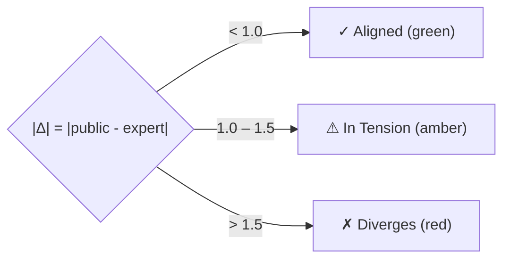
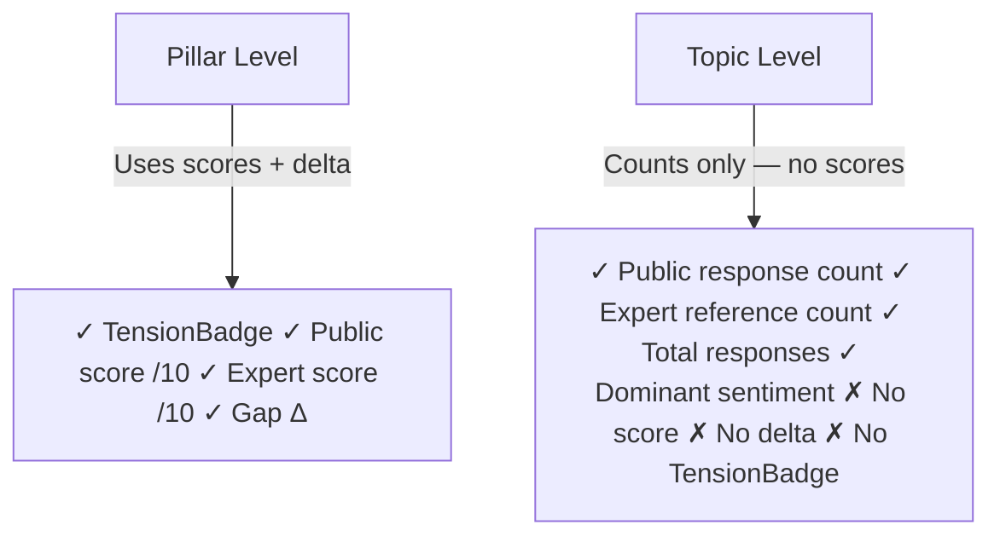
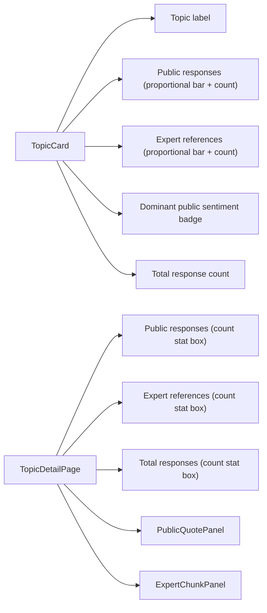

# GovAI Dashboard

**Canada AI Task Force — National AI Strategy Consultation Dashboard**

An open-source data visualisation platform that makes Canada's 2025 national AI strategy consultation transparent and explorable. The Government of Canada's official summary was vague and contained no data weighting — this dashboard surfaces what **11,383 Canadians** actually said, and where 28 Task Force experts agree or diverge from public opinion.

Data released under [Open Government Licence (Canada)](https://open.canada.ca/en/open-government-licence-canada) · Source: `open.canada.ca`

---

## Key Numbers

| Metric                 | Value  |
| ---------------------- | ------ |
| Total Respondents      | 11,383 |
| Fully Submitted        | 3,162  |
| Open-text Responses    | 68,702 |
| Survey Questions       | 26     |
| Task Force Experts     | 28     |
| Expert Reports         | 32     |
| Strategic Pillars      | 8      |
| Mapped Recommendations | 93     |

---

## Tech Stack

| Layer         | Technology                                |
| ------------- | ----------------------------------------- |
| Frontend      | React 19 + TypeScript 5.9                 |
| Build         | Vite 7                                    |
| Styling       | Tailwind CSS v4 (Oxide engine)            |
| Charts        | Recharts 3                                |
| Routing       | React Router v7                           |
| Data Pipeline | Python 3.11 + Groq (llama-3.1-8b-instant) |
| Database      | SQLite (intermediate pipeline store)      |
| Deployment    | Vercel                                    |

---

## System Architecture



---

## Data Pipeline

The pipeline transforms raw government XLSX data and expert DOCX reports into structured JSON consumed by the React frontend. No backend server runs at runtime — all data is pre-processed and baked into static JSON.



### Scoring Formula

```
score = salience_weight × depth_weight

Salience:  primary=3  secondary=2  passing=1
Depth:     evidence-based=3  reasoned=2  assertion=1

Pillar priority score = Σ(chunk scores) / max_possible
Normalized to 0–10 scale
```

---

## Frontend Architecture



### State Management



---

## The 8 Strategic Pillars

| #   | Pillar                       | Public | Expert | Status    | Recs |
| --- | ---------------------------- | ------ | ------ | --------- | ---- |
| P1  | Talent & Research            | 8.9    | 9.1    | ✓ Aligned | 14   |
| P2  | Data & Infrastructure        | 8.7    | 8.8    | ✓ Aligned | 11   |
| P3  | Adoption & Commercialization | 9.1    | 8.5    | ⚠ Tension | 12   |
| P4  | Regulation & Governance      | 8.5    | 8.3    | ✓ Aligned | 16   |
| P5  | International Collaboration  | 7.6    | 7.9    | ✓ Aligned | 8    |
| P6  | Public Trust & Safety        | 9.1    | 8.7    | ✓ Aligned | 13   |
| P7  | Inclusive AI                 | 6.2    | 7.5    | ⚠ Tension | 10   |
| P8  | Sovereignty & Security       | 8.2    | 8.1    | ✓ Aligned | 9    |

### Alignment Logic

Alignment scoring (aligned / tension / diverges) is applied at the **pillar level only**, where both public and expert scores are derived independently from different data sources and can be meaningfully compared.



### Topic-Level Display Design





---

## Key Insights

1. **Adoption & Commercialization is a timing debate, not a conflict.** Both public (9.1) and experts (8.5) agree on commercialization. The tension is pace vs. safety guardrails. Canada has lost 42 percentage points of AI company retention since 2016.

2. **Inclusive AI has an awareness gap, not a values gap.** Only 25% of public respondents mentioned inclusion keywords vs. 83% for trust/safety. The public wasn't sufficiently prompted — the gap doesn't signal opposition.

3. **Public Trust & Safety dominates public concern.** 83% of all text responses included trust/safety keywords — no other topic comes close.

4. **Geographic concentration is a structural data risk.** Ontario (38.9%) and BC (20.7%) account for ~60% of responses. Northern, rural, and Atlantic voices are underrepresented.

5. **6 of 8 pillars are broadly aligned.** The public-vs-expert conflict narrative is overblown. Canada has strong consensus to build on.

---

## Getting Started

### Prerequisites

- Node.js 18+
- npm 9+

### Install & Run

```bash
npm install
npm run dev          # http://localhost:5173
```

### Production Build

```bash
npm run build        # outputs to dist/
npm run preview      # preview the production build
```

---

## Data Pipeline Setup

The pipeline requires the raw government XLSX file (not included in this repo due to size).

```bash
# Install Python deps
pip install groq openpyxl python-docx python-dotenv

# Set environment variables
export GROQ_API_KEY=your_key_here
export XLSX_PATH=/path/to/ai-strategy-raw-data-2025-1.xlsx

# Run pipeline
cd pipeline
bash run_pipeline.sh
```

### Pipeline Scripts

| Script                     | Function                                       |
| -------------------------- | ---------------------------------------------- |
| `01_load_xlsx.py`          | Parse XLSX → SQLite                            |
| `02_pass1_atomize.py`      | LLM: Break responses into atomic claims        |
| `03_pass2_label.py`        | LLM: Assign sentiment, salience, depth, pillar |
| `04_pass3_canonicalize.py` | LLM: Normalize expert chunks                   |
| `05_export_json.py`        | Export to `src/data/*.json`                    |

---

## Project Structure

```
govai-dashboard/
├── src/
│   ├── App.tsx                    # Router + DashboardProvider
│   ├── context/DashboardContext.tsx
│   ├── data/                      # Pre-processed JSON data
│   │   ├── pillars.json
│   │   ├── demographics.json
│   │   ├── alignmentMap.json
│   │   ├── recommendations.json
│   │   ├── topics.json
│   │   ├── quotes.json
│   │   └── expert_chunks.json
│   ├── pages/                     # 6 route pages
│   ├── components/
│   │   ├── charts/                # 6 Recharts visualisations
│   │   ├── cards/                 # PillarCard, RecommendationCard, TopicCard
│   │   ├── viewer/                # PublicQuotePanel, ExpertChunkPanel
│   │   └── ui/                    # Badges, Toggle, SectionHeader
│   └── types/index.ts
├── pipeline/                      # Python data pipeline
├── public/                        # Static assets
├── vercel.json
└── package.json
```

---

## Deployment

This project deploys to Vercel as a static site:

```json
// vercel.json
{
  "buildCommand": "npm run build",
  "outputDirectory": "dist",
  "framework": "vite"
}
```

For Netlify, `netlify.toml` is also included with SPA redirect rules.

---

## Documentation

- [`SYSTEM_OVERVIEW.md`](./SYSTEM_OVERVIEW.md) — Full conceptual documentation of all entities, visualisations, and design decisions
- [`GovAI_Dashboard_Project_Report.pdf`](./GovAI_Dashboard_Project_Report.pdf) — Complete technical analysis report with architecture diagrams

---

## License

Data: [Open Government Licence (Canada)](https://open.canada.ca/en/open-government-licence-canada)  
Code: MIT
